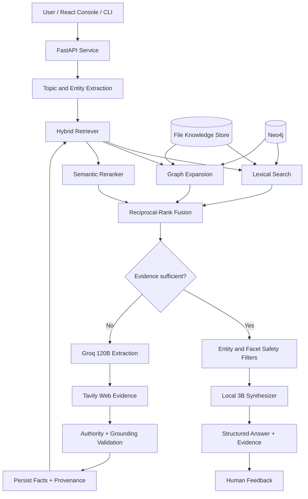
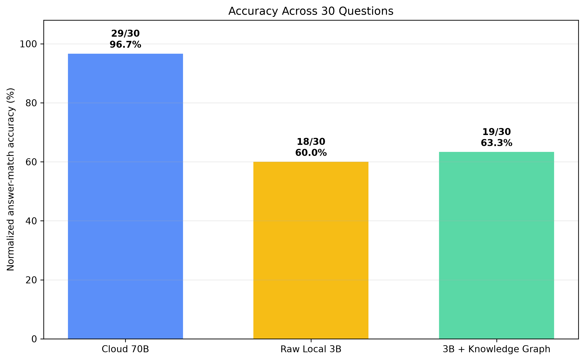

# Agentic Knowledge Graph RAG

> A Windows-first, evidence-aware retrieval-augmented generation system that combines a persistent knowledge graph, hybrid retrieval, cloud-assisted knowledge expansion, web provenance, and a locally executed 3B model for final answer synthesis.

[](https://www.python.org/)
[](https://fastapi.tiangolo.com/)
[](https://react.dev/)
[](https://neo4j.com/)
[](#testing)

Agentic Knowledge Graph RAG is designed around a simple principle: **the final local model should not need to know everything; it should receive the right verified context**. The pipeline first searches existing code and knowledge, evaluates whether the evidence is sufficient, expands missing knowledge through a cloud reasoning model and web search when necessary, stores grounded facts with their sources, and finally asks a local 3B model to produce a readable answer.

The project includes a FastAPI backend, a React knowledge console, file-backed and Neo4j storage, human feedback capture, source-level provenance, confidence routing, hardware-aware local inference, Prometheus metrics, migration utilities, and reproducible evaluation scripts.

---

## Table of contents

- [Why this project exists](#why-this-project-exists)
- [Key capabilities](#key-capabilities)
- [System architecture](#system-architecture)
- [Request lifecycle](#request-lifecycle)
- [Technology stack](#technology-stack)
- [Repository structure](#repository-structure)
- [Requirements](#requirements)
- [Windows quick start](#windows-quick-start)
- [Configuration](#configuration)
- [Running the application](#running-the-application)
- [React knowledge console](#react-knowledge-console)
- [API reference](#api-reference)
- [Storage backends](#storage-backends)
- [Local 3B runtime selection](#local-3b-runtime-selection)
- [Trust, provenance, and entity safety](#trust-provenance-and-entity-safety)
- [Human feedback loop](#human-feedback-loop)
- [Evaluation and results](#evaluation-and-results)
- [Testing](#testing)
- [Observability](#observability)
- [Troubleshooting](#troubleshooting)
- [Known limitations](#known-limitations)
- [Security notes](#security-notes)
- [Development workflow](#development-workflow)
- [Roadmap](#roadmap)

---

## Why this project exists

Large cloud models can answer broad questions, but they introduce network dependency, recurring cost, privacy concerns, and limited control over long-term knowledge. Small local models are private and inexpensive, but they are more vulnerable to missing knowledge and hallucination.

This project combines their strengths:

1. Reuse previously verified local knowledge whenever possible.
2. Retrieve evidence using lexical, semantic, and graph signals.
3. Reject unrelated facts even when their retrieval score is high.
4. Expand missing knowledge using the configured cloud model.
5. Ground web-derived facts in retained URLs and excerpts.
6. Store accepted facts for future questions.
7. Give the local 3B model only the selected evidence.
8. Collect human judgements for later review and improvement.

The result is not merely a chatbot. It is a continuously growing, inspectable knowledge system in which answers can be traced back to facts and sources.

## Key capabilities

### Evidence-aware retrieval

- Reciprocal-rank fusion across lexical search, graph expansion, and optional semantic reranking.
- Configurable top-k retrieval and confidence thresholds.
- Confidence routing between local answering and knowledge expansion.
- Named-entity coverage checks that prevent generic facts from satisfying a person-specific question.
- Typo-tolerant name matching for minor spelling differences.
- Person-profile filtering that prevents facts about one individual from being used for another.

### Trustworthy knowledge ingestion

- Stable SHA-256 identifiers for facts.
- Fact-level confidence and verification status.
- Source URL, title, excerpt, provider, retrieval time, and search score retention.
- First-party and academic sources ranked above generic aggregators.
- Source-content checks on both the subject and object of extracted facts.
- Campus/location consistency checks for institution-specific profile questions.
- Rejection of unsupported web-extracted triples.

### Dual-model generation

- `openai/gpt-oss-120b` through Groq for topic extraction and web-grounded fact extraction.
- A local Qwen-family 3B model for final answer synthesis.
- The cloud model expands the knowledge graph; it is not treated as a factual source by itself.
- The local model is instructed to answer only from supplied evidence and produce natural-language profiles rather than raw triples.

### Production-facing components

- FastAPI service with typed request/response models.
- React + TypeScript frontend built with Vite.
- File-based development store requiring no external database.
- Neo4j store with constraints, indexes, graph traversal, and source nodes.
- Prometheus metrics, structured logging, health probes, and readiness checks.
- Append-only feedback records.
- Docker Compose configuration for Neo4j.
- A canvas-rendered knowledge-base explorer with domain filters, search, zoom, pan, inspection, and server-side pagination.

## System architecture



The active store is selected with `RAG_STORE_BACKEND`. File mode is ideal for local development. Neo4j mode adds indexed graph traversal and first-class source relationships.

## Request lifecycle

For a `POST /v1/chat` request, the backend performs the following steps:

1. **Extract entities** from the question using the configured Groq model when available.
2. **Search the local store** using lexical matching and graph expansion.
3. **Optionally rerank semantically** using `sentence-transformers/all-MiniLM-L6-v2`.
4. **Fuse retrieval channels** using reciprocal-rank fusion.
5. **Calculate confidence** using top-result strength, evidence depth, and domain diversity.
6. **Validate entity coverage**, especially for named-person questions.
7. **Check requested facets**, such as qualifications, publications, research, or experience.
8. If evidence is insufficient, **search the web and extract new facts** using the 120B model.
9. **Validate every proposed fact** against the retrieved source content.
10. **Persist accepted facts and provenance** in the configured store.
11. Retrieve again and **filter context to the requested entity**.
12. Ask the local 3B model to produce a concise, evidence-cited answer.
13. Return the answer, route, confidence, expanded-fact count, and evidence records.

For person profiles, the model is asked to use sections such as Role, Affiliation, Qualifications, Expertise, and Location. Unsupported sections are omitted.

## Technology stack

| Layer | Technology |
|---|---|
| API | FastAPI, Uvicorn, Pydantic |
| Frontend | React, TypeScript, Vite, Lucide React |
| Local inference | Transformers, PyTorch, bitsandbytes |
| Cloud extraction | Groq Python SDK, `openai/gpt-oss-120b` |
| Web grounding | Tavily Search API |
| Semantic retrieval | Sentence Transformers |
| Graph database | Neo4j 5.x |
| File store | Text triples + JSONL provenance |
| Metrics | Prometheus client |
| Evaluation | pytest, matplotlib, CSV/JSON reports |

## Repository structure

```text
Agentic-Knowledge-Graph/
|-- data/
|   `-- rag/
|       |-- rag_knowledge.txt       # File-backed graph triples
|       |-- fact_provenance.jsonl   # Source and verification metadata
|       `-- answer_feedback.jsonl   # Human review records
|-- eval/
|   |-- codex-accuracy/             # 30-question charts and scoring script
|   |-- results/                    # Evaluation artifacts
|   |-- gold_set.json               # Human-authored evaluation truth
|   `-- run_*.py                    # Evaluation runners
|-- frontend/
|   |-- src/                        # React application
|   |-- package.json
|   `-- vite.config.ts
|-- src/
|   `-- rag_pipeline/
|       |-- agent.py                # Model loading, extraction, web grounding, CLI
|       |-- api.py                  # FastAPI routes
|       |-- domain.py               # Fact, Source, RetrievalResult models
|       |-- factory.py              # Store selection
|       |-- maintenance.py          # Recoverable graph cleanup utilities
|       |-- migrate.py              # File-to-Neo4j migration
|       |-- observability.py        # Logging and Prometheus metrics
|       |-- retrieval.py            # Hybrid retrieval and confidence routing
|       |-- service.py              # End-to-end application service
|       |-- settings.py             # Environment configuration
|       `-- stores/
|           |-- base.py
|           |-- file.py
|           `-- neo4j.py
|-- tests/                           # Retrieval, grounding, and safety tests
|-- .env.example
|-- docker-compose.yml
|-- Dockerfile
|-- pyproject.toml
`-- README.md
```

Local model weights are intentionally not part of the repository. Place them in the path configured by `LOCAL_MODEL_PATH`.

## Requirements

### Required

- Windows 10 or Windows 11
- Python 3.11 or newer
- Git
- A local Transformers-compatible 3B model directory
- A Groq API key for cloud topic extraction and knowledge expansion

### Optional

- NVIDIA CUDA-capable GPU for 4-bit NF4 inference
- Tavily API key for web-grounded expansion
- Node.js 20+ and npm for the React frontend
- Docker Desktop for local Neo4j
- 8 GB or more available RAM for CPU inference; additional memory is recommended

## Windows quick start

Clone and enter the repository:

```powershell
git clone https://github.com/himanshu2005-tech/Agentic-Knowledge-Graph.git
cd Agentic-Knowledge-Graph
```

Create a virtual environment:

```powershell
python -m venv .venv
.\.venv\Scripts\Activate.ps1
python -m pip install --upgrade pip
```

Install the project:

```powershell
# CPU and general development dependencies
python -m pip install -e ".[dev]"

# NVIDIA GPU support, including bitsandbytes
python -m pip install -e ".[gpu,dev]"
```

Create local configuration:

```powershell
Copy-Item .env.example .env
```

Edit `.env`, set `GROQ_API_KEY`, optionally set `TAVILY_API_KEY`, and point `LOCAL_MODEL_PATH` to the local 3B model directory.

Start the backend:

```powershell
python -m uvicorn src.rag_pipeline.api:app --host 127.0.0.1 --port 8000
```

Verify readiness in another PowerShell window:

```powershell
Invoke-RestMethod http://127.0.0.1:8000/health/ready
```

The local model loads lazily on the first chat request, so the first answer can take longer than later answers.

## Configuration

Configuration is loaded from environment variables and the root `.env` file.

| Variable | Default | Description |
|---|---|---|
| `GROQ_API_KEY` | empty | Groq credential used for topic and fact extraction |
| `TAVILY_API_KEY` | empty | Enables web-grounded knowledge expansion |
| `KG_MODEL` | `openai/gpt-oss-120b` | Cloud extraction/reasoning model |
| `LOCAL_MODEL_PATH` | `local_qwen_3b` | Local Transformers model directory |
| `RAG_ENV` | `development` | Environment label |
| `RAG_LOG_LEVEL` | `INFO` | Backend logging level |
| `RAG_STORE_BACKEND` | `file` | `file` or `neo4j` |
| `RAG_RETRIEVAL_TOP_K` | `12` | Maximum returned retrieval hits |
| `RAG_CONFIDENCE_THRESHOLD` | `0.60` | Minimum confidence for local routing |
| `RAG_EMBEDDING_MODEL` | `sentence-transformers/all-MiniLM-L6-v2` | Semantic reranker model |
| `RAG_ENABLE_EMBEDDINGS` | `true` | Enables semantic reranking |
| `RAG_CORS_ORIGINS` | localhost Vite URLs | Comma-separated allowed frontend origins |
| `NEO4J_URI` | `bolt://localhost:7687` | Neo4j Bolt endpoint |
| `NEO4J_USERNAME` | `neo4j` | Neo4j username |
| `NEO4J_PASSWORD` | `change-me` | Neo4j password |
| `NEO4J_DATABASE` | `neo4j` | Neo4j database name |

Never commit `.env`, API keys, downloaded model weights, or database credentials.

## Running the application

### Backend API

```powershell
.\.venv\Scripts\Activate.ps1
python -m uvicorn src.rag_pipeline.api:app --host 127.0.0.1 --port 8000
```

Useful URLs:

- Swagger UI: `http://127.0.0.1:8000/docs`
- ReDoc: `http://127.0.0.1:8000/redoc`
- Liveness: `http://127.0.0.1:8000/health/live`
- Readiness: `http://127.0.0.1:8000/health/ready`
- Metrics: `http://127.0.0.1:8000/metrics`

### Interactive CLI

```powershell
python -m src.rag_pipeline.agent --runtime auto
```

Explicit runtime overrides:

```powershell
python -m src.rag_pipeline.agent --runtime gpu-4bit
python -m src.rag_pipeline.agent --runtime cpu-int8
```

Enter `quit` or `exit` to stop the CLI.

## React knowledge console

The frontend provides:

- A conversational interface for the full RAG pipeline.
- Backend, store, fact-count, and model status.
- Answer confidence and unique source counts.
- An evidence panel with retrieved facts, scores, and source links.
- Correct, incorrect, and incomplete feedback controls.
- Responsive layouts for desktop and mobile displays.
- A dedicated **Knowledge graph** workspace for visually exploring entities and relationships.

### Scalable graph explorer

Select **Knowledge graph** in the left navigation to open the visual explorer. The view supports:

- Canvas rendering instead of one DOM element per node.
- 100, 200, or 500 facts per page.
- Server-side search, domain filtering, and pagination.
- Domain-based spatial grouping and colors.
- Mouse-wheel zoom and pointer-based panning.
- Node and relationship inspection.
- Fact confidence, verification status, and source count display.

The complete knowledge base is never forced into the browser at once. In Neo4j mode, filtering, counting, ordering, and pagination are executed by the database. This bounded-slice design allows the same interface to remain usable as the graph grows well beyond the current dataset.

Start the API in one PowerShell window. In a second window:

```powershell
cd frontend
npm install
npm run dev
```

Open `http://127.0.0.1:5173`.

Vite proxies `/api` to the backend during development, so cloud credentials remain on the server and are never required in browser code.

Build the production frontend:

```powershell
cd frontend
npm run build
```

The bundle is written to `frontend/dist/`. For a separately hosted API, create `frontend/.env.local`:

```env
VITE_API_BASE_URL=http://127.0.0.1:8000
```

Add the deployed frontend origin to `RAG_CORS_ORIGINS`.

## API reference

### `POST /v1/chat`

Runs retrieval, optional expansion, and local synthesis.

Request:

```json
{
  "question": "Who developed the Python programming language?"
}
```

Response shape:

```json
{
  "answer": "Guido van Rossum developed Python. [F1]",
  "confidence": 0.82,
  "route": "local",
  "expanded_facts": 0,
  "evidence": [
    {
      "label": "F1",
      "fact": {
        "id": "...",
        "domain": "Programming",
        "subject": "GuidoVanRossum",
        "relation": "created",
        "object": "Python",
        "sources": []
      },
      "score": 0.81,
      "reasons": ["graph", "lexical"]
    }
  ]
}
```

### `POST /v1/retrieve`

Runs retrieval without loading the local answer model.

```powershell
$body = @{
  query = "Explain quantum mechanics"
  entities = @("QuantumMechanics")
} | ConvertTo-Json

Invoke-RestMethod `
  -Method Post `
  -Uri http://127.0.0.1:8000/v1/retrieve `
  -ContentType application/json `
  -Body $body
```

### `POST /v1/feedback`

Stores a human judgement and the fact IDs involved in the answer.

```json
{
  "question": "Who developed Python?",
  "verdict": "correct",
  "note": "Verified against the linked source.",
  "fact_ids": ["fact-sha256-id"]
}
```

Allowed verdicts are `correct`, `incorrect`, and `incomplete`.

### `GET /v1/graph`

Returns a bounded visualization slice containing entity nodes, fact edges, domain statistics, and pagination metadata.

| Parameter | Default | Limits | Purpose |
|---|---:|---:|---|
| `query` | empty | 200 characters | Filter by entity or relation text |
| `domain` | empty | 100 characters | Restrict results to one domain |
| `offset` | `0` | non-negative | Starting fact offset |
| `limit` | `200` | 1–500 | Maximum facts in the returned slice |

Example:

```powershell
Invoke-RestMethod "http://127.0.0.1:8000/v1/graph?domain=ComputerScience&limit=200"
```

### Health and metrics

| Endpoint | Purpose |
|---|---|
| `GET /health/live` | Confirms that the API process is alive |
| `GET /health/ready` | Checks the active store and reports model/expansion status |
| `GET /metrics` | Exposes Prometheus-compatible request, latency, and routing metrics |

## Storage backends

### File-backed mode

File mode is the default and requires no external services:

```env
RAG_STORE_BACKEND=file
```

It uses:

- `data/rag/rag_knowledge.txt` for graph triples.
- `data/rag/fact_provenance.jsonl` for source metadata.
- `data/rag/answer_feedback.jsonl` for human feedback.

The text format remains compatible with the original CLI:

```text
[domain=Programming] (GuidoVanRossum, created, Python)
```

Provenance is stored separately using the fact's stable hash ID.

### Neo4j mode

Start Neo4j:

```powershell
docker compose up -d neo4j
```

Set a secure password in `.env`:

```env
RAG_STORE_BACKEND=neo4j
NEO4J_URI=bolt://localhost:7687
NEO4J_USERNAME=neo4j
NEO4J_PASSWORD=replace-with-a-strong-password
NEO4J_DATABASE=neo4j
```

Migrate existing file-backed facts:

```powershell
python -m src.rag_pipeline.migrate --batch-size 500
```

Neo4j mode provides:

- Uniqueness constraints for facts and sources.
- Full-text lookup.
- Parameterized and idempotent writes.
- Graph-neighbor expansion.
- Explicit fact-to-source relationships.

Open the Neo4j browser at `http://localhost:7474` when using the provided Docker Compose service.

## Local 3B runtime selection

The project is Windows-first and automatically selects a local runtime:

| Hardware | Selected runtime | Loading strategy |
|---|---|---|
| NVIDIA CUDA GPU | `gpu-4bit` | bitsandbytes 4-bit NF4 with double quantization |
| CPU-only machine | `cpu-int8` | PyTorch dynamic INT8 quantization |

The auto-detection command is:

```powershell
python -m src.rag_pipeline.agent --runtime auto
```

GPU inference requires a compatible PyTorch/CUDA setup and bitsandbytes installation. CPU inference avoids a GPU dependency but can be significantly slower and requires sufficient RAM.

If loading stops near `Loading weights`, check available RAM/VRAM, confirm that the model directory contains a complete Transformers checkpoint, and test the explicit runtime modes.

## Trust, provenance, and entity safety

The project treats model output as a proposal, not as verified knowledge.

### Fact provenance

Each accepted fact can include:

- Provider name.
- Source URL and title.
- Evidence excerpt.
- Retrieval timestamp.
- Search score.
- Extraction model.
- Verification status.
- Fact confidence.

### Web-source ranking

The pipeline:

1. Extracts meaningful query terms.
2. Filters irrelevant pages.
3. Prefers academic, government, standards, and first-party sources.
4. Applies typo-tolerant identity matching.
5. Requires requested campus/location qualifiers to appear in the source.
6. Checks that both sides of a proposed fact occur in supporting evidence.
7. Stores only grounded facts.

### Person-profile safeguards

Named-person questions receive additional controls:

- Unsourced legacy LLM facts cannot unlock a confident identity answer.
- Facts about another person are removed before final synthesis.
- Generic campus facts cannot be used to infer a person's location or affiliation.
- Personal qualifications cannot be assigned to a university or campus entity.
- If identity evidence is insufficient, the system returns: `I do not have enough verified evidence to answer.`

These safeguards reduce entity collisions, which are especially common when multiple people have similar names.

## Human feedback loop

The React console and API accept three judgements:

- **Correct** — the answer is sufficiently supported and accurate.
- **Incorrect** — one or more claims are wrong or attached to the wrong entity.
- **Incomplete** — supported information is missing from the answer.

Feedback is appended to `data/rag/answer_feedback.jsonl` with the question, note, submission time, and relevant fact IDs. It is intentionally not used to silently rewrite graph facts. A review or curation step should decide whether facts are retained, corrected, or removed.

This separation preserves auditability and makes the data suitable for later preference tuning or supervised fine-tuning.

## Evaluation and results

The repository includes evaluations for:

- Three-model answer comparison.
- Actual local 3B + RAG behavior.
- Triplet extraction F1.
- Cost and latency.
- Component ablation.
- Quantization quality delta.
- Generated-code execution pass rate.

### 30-question comparison

The normalized expected-answer benchmark currently reports:

| Configuration | Correct | Accuracy |
|---|---:|---:|
| Cloud model | 29/30 | 96.7% |
| Raw local 3B | 18/30 | 60.0% |
| Local 3B + knowledge graph | 19/30 | 63.3% |



Additional charts:

- [Per-question correctness heatmap](eval/codex-accuracy/02_question_heatmap.png)
- [Cumulative accuracy](eval/codex-accuracy/03_cumulative_accuracy.png)
- [Accuracy by question category](eval/codex-accuracy/04_category_accuracy.png)

The scorer normalizes punctuation, Markdown, case, and unusual Unicode spacing before checking expected answers. This is a deterministic expected-answer match, not a semantic or human-judged factuality score.

Reproduce the charts:

```powershell
python eval/codex-accuracy/plot_30_question_analysis.py
```

Read [eval/README.md](eval/README.md) for all evaluation commands. Some evaluations call paid or rate-limited external APIs; review the script and configure credentials before running them.

## Testing

Run the Python test suite:

```powershell
python -m pytest -q
```

The tests cover:

- File-store round trips and source preservation.
- Hybrid retrieval and confidence routing.
- Unknown named-entity rejection.
- Minor name-spelling differences.
- Person-profile evidence isolation.
- Requested-facet completeness.
- Deterministic credential extraction.
- Web-source authority ranking.
- Campus/location consistency.
- Unsupported triple rejection.

Build the frontend as a type and production-bundle check:

```powershell
npm --prefix frontend run build
```

## Observability

The backend exposes Prometheus metrics at `/metrics`, including request counts, route counts, and endpoint latency. Logs are structured for ingestion by common log processors.

Readiness reports:

- Active storage backend health.
- Stored fact count where supported.
- Whether the local model has been loaded.
- Whether cloud expansion is configured.

The distinction between liveness and readiness makes the API suitable for container orchestration and service monitoring.

## Troubleshooting

### `ModuleNotFoundError: No module named 'groq'`

Activate the project environment and reinstall dependencies:

```powershell
.\.venv\Scripts\Activate.ps1
python -m pip install -e ".[dev]"
```

### Groq rejects `max_completion_tokens`

Upgrade the Groq SDK installed in the active environment:

```powershell
python -m pip install --upgrade groq
python -c "import groq; print(groq.__version__)"
```

Ensure that `python`, `pip`, and `uvicorn` are all running from the same virtual environment.

### The model remains at `Loading weights: 0%`

- Wait for disk loading and memory allocation to complete.
- Confirm that all model shard files exist.
- Check free RAM and NVIDIA VRAM.
- Use `--runtime cpu-int8` to isolate CUDA/bitsandbytes problems.
- Use `--runtime gpu-4bit` to fail early if CUDA is unavailable.

### The frontend cannot reach the API

- Confirm `http://127.0.0.1:8000/health/ready` works.
- Confirm the frontend is running at port 5173.
- Check `VITE_API_BASE_URL` if the frontend is hosted separately.
- Add the frontend URL to `RAG_CORS_ORIGINS`.
- Restart Vite after changing frontend environment variables.

### Old or deleted facts still appear

The file store is loaded into the running backend process. Restart Uvicorn after manually cleaning or migrating graph data.

### A person answer combines unrelated evidence

Restart the backend to ensure the latest entity-safety code is active. Inspect the evidence panel and submit an incorrect or incomplete judgement with the affected fact IDs.

### Neo4j is not ready

```powershell
docker compose ps
docker compose logs neo4j
Test-NetConnection localhost -Port 7687
```

Confirm that the password in `.env` matches the container configuration.

## Known limitations

- The 3B model can still produce awkward wording even when the evidence is correct.
- Retrieval confidence is a routing signal, not a calibrated probability of factual correctness.
- Web pages can be incomplete, stale, duplicated, or incorrect.
- Name similarity cannot fully resolve two distinct people with nearly identical names.
- The file store is appropriate for local development but is not intended for high-write distributed workloads.
- CPU inference for a 3B model can be slow.
- Evaluation keyword matching does not replace expert human evaluation.
- Human feedback is captured but not automatically applied to model weights.
- Neo4j and web search are optional and require external services.

For high-stakes use cases, verify important claims directly against the linked primary sources.

## Security notes

- Keep Groq, Tavily, and Neo4j credentials in `.env` or a secret manager.
- Never expose provider keys through `VITE_` environment variables; those values are bundled into browser code.
- The included Neo4j password is a development placeholder and must be changed.
- Treat web excerpts and user questions as untrusted input.
- Do not expose an unauthenticated deployment directly to the public internet.
- Add authentication, rate limiting, TLS, request-size limits, and network restrictions before public deployment.
- Review generated code before execution; evaluation scripts that execute code should run in an isolated environment.
- Back up graph and provenance data before bulk cleanup or migration.

## Development workflow

Before submitting changes:

```powershell
python -m pytest -q
npm --prefix frontend run build
```

When modifying retrieval or ingestion behavior:

1. Add a regression test reproducing the failure.
2. Preserve raw source and provenance data.
3. Verify that unrelated entities remain rejected.
4. Run the focused tests and then the complete suite.
5. Restart the backend before testing through React.
6. Inspect both the answer and evidence panel.

When modifying evaluation logic, keep original outputs unchanged and write derived charts or scores to a separate results directory.

## Roadmap

Potential next steps include:

- Human review queue for approving, correcting, merging, and deleting facts.
- Entity-resolution records and explicit aliases instead of fuzzy matching alone.
- Temporal validity and contradiction detection.
- Source freshness monitoring and scheduled revalidation.
- Cross-encoder reranking for difficult retrieval cases.
- Semantic answer evaluation and LLM-as-a-judge with human calibration.
- Fine-tuning dataset export from verified answers and reviewed feedback.
- Authentication and per-user knowledge namespaces.
- Background workers for web expansion and graph maintenance.
- OpenTelemetry traces and production dashboards.
- Automated backup, restore, and Neo4j migration verification.

---

## Repository

GitHub: [himanshu2005-tech/Agentic-Knowledge-Graph](https://github.com/himanshu2005-tech/Agentic-Knowledge-Graph)

If you use this project for academic evaluation, report the exact commit, model checkpoint, runtime mode, retrieval configuration, and dataset version so the results remain reproducible.
