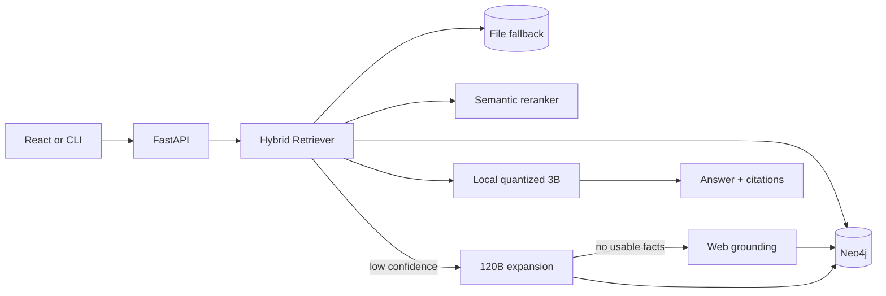

# Agentic Knowledge Graph RAG

A production-oriented RAG system that searches verified local knowledge first, expands missing knowledge through a 120B model, optionally grounds unresolved questions with web evidence, and uses a quantized local 3B model for the final cited answer.

## Architecture



The active production path provides:

- Neo4j constraints, full-text indexes, graph-neighbor expansion, source nodes, and idempotent ingestion.
- A zero-infrastructure file store compatible with `data/rag/rag_knowledge.txt` and JSONL provenance.
- Reciprocal-rank fusion of lexical, graph, and semantic signals.
- Confidence routing: local evidence first, then 120B expansion, then optional web grounding.
- Lazy, thread-safe loading of the local 3B model.
- Evidence labels and source metadata in every API answer.
- JSON logging, Prometheus metrics, liveness/readiness endpoints, typed settings, and feedback capture.
- A migration command from the legacy text graph to Neo4j.

## Quick start

Python 3.11 is recommended.

```powershell
python -m venv .venv
.\.venv\Scripts\Activate.ps1
python -m pip install -e ".[gpu,dev]"
Copy-Item .env.example .env
```

Set `GROQ_API_KEY` in `.env`. `TAVILY_API_KEY` is optional and is only used after local retrieval and the 120B expansion fail.

### File-backed development

Keep this default in `.env`:

```env
RAG_STORE_BACKEND=file
```

Start the API:

```powershell
python -m uvicorn src.rag_pipeline.api:app --host 127.0.0.1 --port 8000
```

Open `http://127.0.0.1:8000/docs` for the OpenAPI UI. The local 3B model loads lazily on the first `/v1/chat` request.

## React knowledge console

The integrated React interface lives in `frontend/`. It includes:

- Chat with the complete KG -> 120B -> web -> local 3B pipeline.
- Backend, store, fact-count, and local-model status.
- Retrieval route and confidence display.
- Per-answer evidence inspection with fact scores and provenance links.
- Correct, incorrect, and incomplete feedback submission.
- Responsive desktop and mobile layouts.

Start the API in the first PowerShell window:

```powershell
cd D:\graph
.\.venv\Scripts\Activate.ps1
python -m uvicorn src.rag_pipeline.api:app --host 127.0.0.1 --port 8000
```

Start React in a second PowerShell window:

```powershell
cd D:\graph\frontend
npm install
npm run dev
```

Open `http://127.0.0.1:5173`. Vite proxies `/api` requests to the FastAPI service, so no frontend secret keys are required. The first chat request can take longer because it lazily loads the local 3B model.

For a production frontend bundle:

```powershell
cd D:\graph\frontend
npm run build
```

The compiled files are written to `frontend/dist/`. To point a separately hosted frontend at another API, create `frontend/.env.local`:

```env
VITE_API_BASE_URL=http://127.0.0.1:8000
```

Add that frontend origin to `RAG_CORS_ORIGINS` in the root `.env`.

### Neo4j production mode

```powershell
docker compose up -d neo4j
```

Configure `.env`:

```env
RAG_STORE_BACKEND=neo4j
NEO4J_URI=bolt://localhost:7687
NEO4J_USERNAME=neo4j
NEO4J_PASSWORD=change-me
NEO4J_DATABASE=neo4j
```

Migrate the legacy facts and provenance:

```powershell
python -m src.rag_pipeline.migrate --batch-size 500
```

Then start the API normally. Readiness checks validate the configured store:

```powershell
Invoke-RestMethod http://127.0.0.1:8000/health/ready
```

## API

- `POST /v1/retrieve` — hybrid retrieval with per-channel scores and routing confidence.
- `POST /v1/chat` — full retrieval/expansion/local-synthesis pipeline with evidence.
- `POST /v1/feedback` — persist correct, incorrect, or incomplete judgements.
- `GET /health/live` — process liveness.
- `GET /health/ready` — dependency and store readiness.
- `GET /metrics` — Prometheus metrics.

Example retrieval request:

```powershell
$body = @{ query = "Explain quantum mechanics"; entities = @("QuantumMechanics") } | ConvertTo-Json
Invoke-RestMethod -Method Post -Uri http://127.0.0.1:8000/v1/retrieve -ContentType application/json -Body $body
```

## CLI

The original interactive CLI remains available:

```powershell
python -m src.rag_pipeline.agent --runtime auto
```

On Windows, `auto` uses 4-bit NF4 on a CUDA GPU and dynamic INT8 on CPU. Use `--runtime gpu-4bit` or `--runtime cpu-int8` to override selection.

## Quality and safety

- Facts have stable SHA-256 IDs, confidence, verification status, timestamps, and source records.
- Generated answers are instructed to cite `[F#]` evidence labels.
- Web-derived facts retain URLs and excerpts.
- Negative feedback is append-only and suitable for review or later preference tuning.
- Neo4j writes are parameterized and idempotent.
- API errors do not expose internal exception details.

Run tests:

```powershell
python -m pytest
```

Run the existing evaluation suite as described in `eval/README.md` after configuring model credentials.
